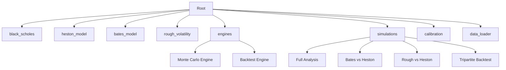
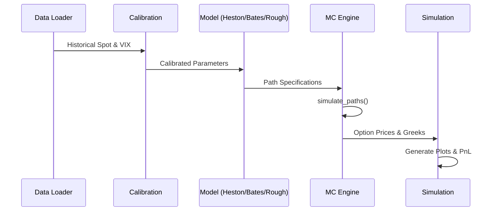

# Stochastic Volatility & Jump-Diffusion Modeling Suite

A professional-grade research and simulation engine for pricing equity derivatives using advanced stochastic volatility models. This suite implements **Heston**, **Bates (Jump-Diffusion)**, and **Rough Heston (Fractional)** models, calibrated to market data and validated through delta-hedging backtests.

## 🚀 Key Features

- **Multi-Model Support**:
  - **Heston Model**: Captures stochastic volatility and leverage effect.
  - **Bates Model**: Extends Heston with Merton-style Poisson jumps.
  - **Rough Heston**: Uses fractional Brownian motion ($H \approx 0.1$) to capture steep short-term skews.
- **Robust Greeks Engine**: High-performance finite difference estimation for **Delta** and **Gamma**.
- **Market Calibration**: Automated fitting of model parameters to market option chains (implied volatility surfaces).
- **Strategy Backtesting**: Comprehensive Delta-Hedging framework to evaluate model performance against historical market regimes (e.g., March 2020 crash).
- **Modular Architecture**: Fully decoupled packages for models, engines, and simulations.
- **Dynamic Data Acquisition**: Key-less scraping of Nifty spot and India VIX data using `yfinance` and `nsepython`.

## 📂 Directory Structure



- **`black_scholes/`**: Analytical baseline for European options.
- **`heston_model/`**: Standard stochastic volatility with Feller condition enforcement.
- **`bates_model/`**: Heston + Jump diffusion components.
- **`rough_volatility/`**: Non-Markovian simulation using hybridized convolution schemes.
- **`engines/`**: Core computational logic for path simulation and hedging.
- **`simulations/`**: End-user scripts for analysis and visualization.
- **`calibration/`**: Optimization logic for parameter estimation from market prices.

## 🛠 Usage & Execution

### 0. Data Refresh (Optional)
Fetches the latest Nifty 50 and India VIX data without requiring API keys.
```powershell
python data_loader/data_loader.py
```

### 1. Full Market Analysis
Runs data fetching, Heston calibration, Greeks calculation, and visualizes the IV smile.
```powershell
python -m simulations.simulation_full_analysis
```

### 2. Rough Heston Comparative Study
Visualizes the impact of the Hurst index (H) on short-term volatility skew.
```powershell
python -m simulations.simulation_rough_analysis
```

### 3. Delta-Hedging Backtest
Evaluates the hedging performance of Heston, Bates, and Rough Heston models.
```powershell
python -m simulations.simulation_backtest
```

## 📊 Modeling Workflow



All visual outputs (PNG) are stored in `output/` and `backtest_results/`. The suite provides side-by-side comparisons of volatility smiles and cumulative hedging errors across different market regimes.

## 📦 Dependencies

- `Python 3.10+`
- `pandas`, `numpy`, `matplotlib`, `scipy`
- `yfinance`: For global index and stock data.
- `nsepython`: For reliable Indian market indices and VIX scraping.

---
*Developed for advanced stochastic calculus research and derivative strategy validation.*
